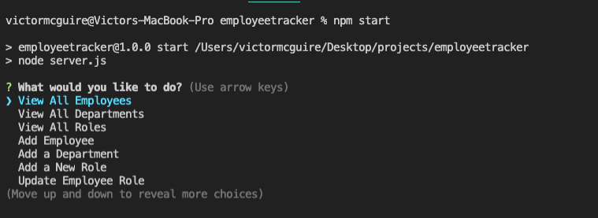
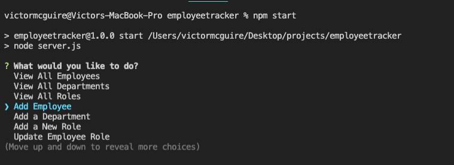
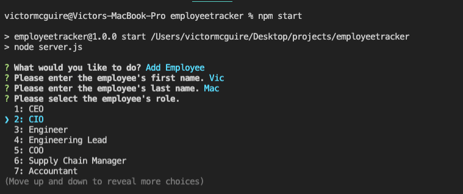
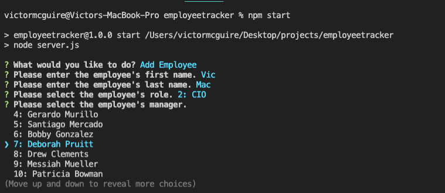
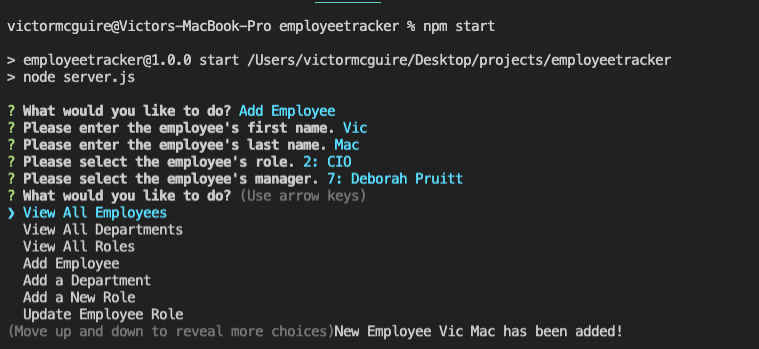
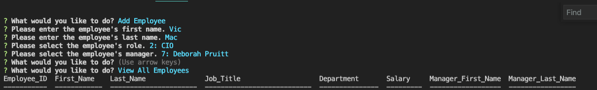

# Employee Tracker

## Week 12 Challenge

### Victor McGuire

## Table of Contents

1. [Description](#Description)
2. [Installation Instructions](#Installation-Instructions)
3. [Usage Instructions](#Usage-Instructions)
4. [Contribution Guidelines](#Contribution-Guidelines)
5. [Test Instructions](#Test-Instructions)
6. [Questions](#Questions)
7. [License](#License)

## Description

The purpose of this project is to create an employee database that can be accessed and used for human resource departments.

## Installation Instructions

Access the application by accessing it here and downloading the files: https://github.com/vmcguire/employeetracker

You will also need inquirer, express, consol.table package and MySQL2 package to connect with the mySQL server.

## Usage Instructions

Navigate to the root folder of the application where the server.js file sits.

To create the data base, you can source the schema.sql file from db/schema.sql into mySQL.

To insert the stock data, you can source the sees.sql file from db/seeds.sql into mySQL.

From the command prompt you will can type in 'npm start' since this is a script in the JSON file.

### Screen Shots Below:

### 1. Here is the opening screen after 'npm start':

### 2. Example selection 'Add Employee':

### 3. Inputting the name and selecting the role of the new employee.

### 4. Selecting the employee manager.

### 5. Selecting View All Employees to see changes made.

### 6. Screenshot showing the headers and the changes made on new ID and row 57.

## Contribution Guidelines

Feel free to contribute and mark your contributions.

## Test Instructions

No testing instructions at this time.

## Questions

Please visit my repo here for any further questions: <https://github.com/vmcguire>

My email address is: <victor.mcguire@gmail.com>

## License
